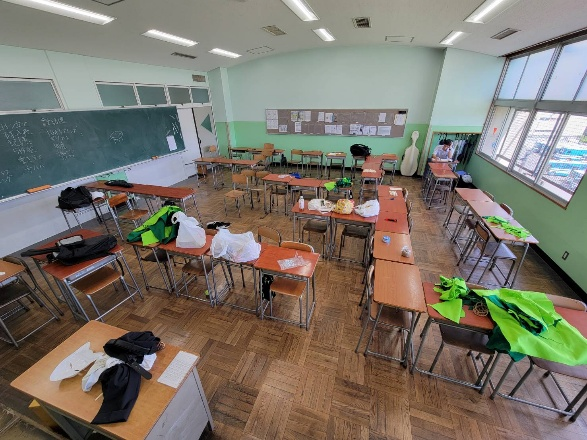
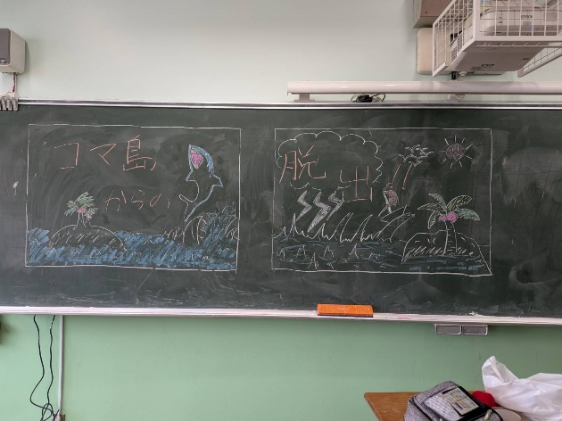
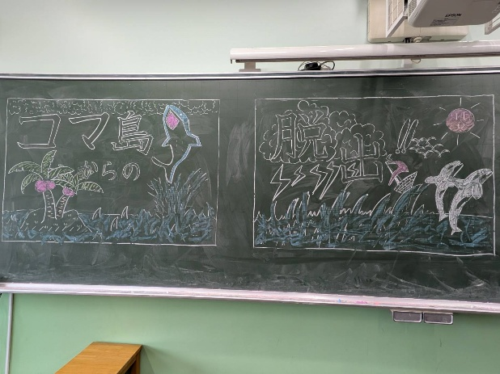

# 1，企画成立までの経緯

　**どうも！当企画長の野村です。**この企画は、硬式テニス部が運営する脱出ゲームです。成立までの経緯として、一昨年に脱出ゲームを実施したところ、非常に好評だったため今年も開催することになりました。そのなかで、どのように一昨年の企画と差別化するか、また新しいコンセプトをどうするかについて、メンバーで意見を出し合い、現在の企画が形になりました。詳しいことは**以下の説明を読んでみてください。**

# 2，企画説明

## **〈コンセプト〉**

参加者の皆さんに、まるでジャングルに迷い込んだかのような感覚を楽しんでもらえるよう、装飾などにこだわり独特な世界観を作り上げる

## **〈内容〉**

頭脳、力、勇気など様々な能力を試される試練を突破し、コマ島からの脱出を目指す

## **〈ゲームの流れ〉**

1，導入ムービーを観る

2，各ブースに設置された試練をクリアして次のブースへ進む

3，試練を通じてポイントを稼ぎ、脱出を目指す

# 3，制作過程

　制作において一番苦労したことは、材料を集める際にいかにコストを抑えるかということです。昨今の物価高もあり、部員から有志企画参加料を集めたのですが、それでも予算にはあまり余裕がなく、大変でした。また、企画を行うにあたって各部門から複数の書類の提出を求められ、それを期限内に仕上げることにも苦労しました。私はもともと期限内に提出物を仕上げることがあまり得意ではないのですが、幹部だけでなく、他の部員からも助けてもらい、必要な提出物は、すべて期限内に提出することができました。また、動画編集や謎解きクイズの作成を得意とする部員があまりいなかったため、部活とは全く関係のない方々に手伝っていただきました。協力してくださった方々、**本当にありがとうございました。**

机を仮置きしてみた様子

# 4，見どころ・工夫したところ

　今回の企画の特徴を紹介します。

・とにかく装飾にこだわり、紙や布、フェルトは東京中のお店を巡って集めた

・参加者の年齢層などに合わせ、様々なゲームを採用した

・装飾だけでなくミニゲームにも世界観や設定を取り入れ、細部まで作り込んだ

・人が多く集まるフロアでの開催ということもあり、広告などは一切行わず、教室前に貼るポスターのデザインに力を注いだ

・絵や動画編集など、それぞれの分野を得意とする人にアドバイスを求め、制作を大きく支えていただいた

教室前ポスターの制作過程

このほかにも、様々なところに工夫を凝らしています。ぜひ、こうした工夫のひとつひとつにも注目していただければと思います。

# 5，おわりに

みんなで考え、ひとつひとつ積み上げてきた企画だからこそ、その成果を文化祭で発揮できることを楽しみにしています。また、制作にあたっては部員をはじめすでに引退された先輩方や各団体の先輩方、顧問の先生方など、多くの方々の支えが欠かせませんでした。この場を借りて、協力してくださった皆様にあらためて感謝を伝えたいと思います。

正直なところ、不器用な自分一人では、この企画をここまで形にすることは到底できませんでした。それでも完成に近づくことができたのは、皆様の支えがあってこそだと思います。まだ作業は続きますが、文化祭本番で皆様に楽しんでいただけるよう、これからもより一層準備に力を入れていきます。これまで多くの方に支えられて作り上げてきた「コマ島からの脱出!!」をぜひ実際に体験していただけたらと思います。**皆さんの挑戦をコマ島でお待ちしております！**
