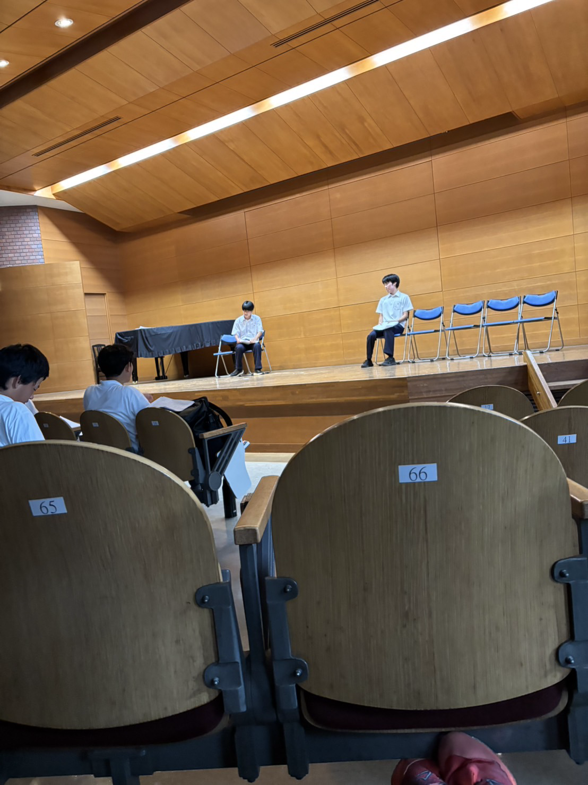

演劇同好会について

こんにちは副会長です。昨年廃部の危機に晒された演劇同好会。幻となるはずだった最高の団体が今年の文化祭に舞い降りる。部員13人で挑む今年の文化祭は昨年とはワケが違う。あっ会員でしたね。全てのコントを新調し、51R、講堂、ステージ、全ての舞台の主役を我が演劇同好会が占拠する。

今年の文化祭は期末試験終了直後、7月の頭から台本の制作を開始し、過去稀に見る素晴らしい仕上がりだ、いや過去1の仕上がりと言える。昨年の惨状はどこに行ったのか。覚醒した会長が引っ張る今年の演劇同好会はまさに最強の集団と化し、今年の文化祭の1つの美しいピースとなることは間違いないだろう。

今年は1人2個のコント作成が義務付けられた。全てのコントを新調し、新しく、新鮮な笑いを観客の皆様にお届けします。

また今年は1日目にステージにも参戦。講堂とは別の劇をステージで行う。大層な試みだが、準備は万全。どんなステージイベントよりも最高の空気を作り上げる。

昨年から去った仲間、新たに迎えた仲間、気づいた時に数えてみたら13人。悲願の"部"昇格に向け、大衆賞獲得に向け、今年も歯車が回り出す。駒東の文化祭に来たら、まず演劇同好会へ。

1日目:ステージ、51R

2日目:講堂、51R

