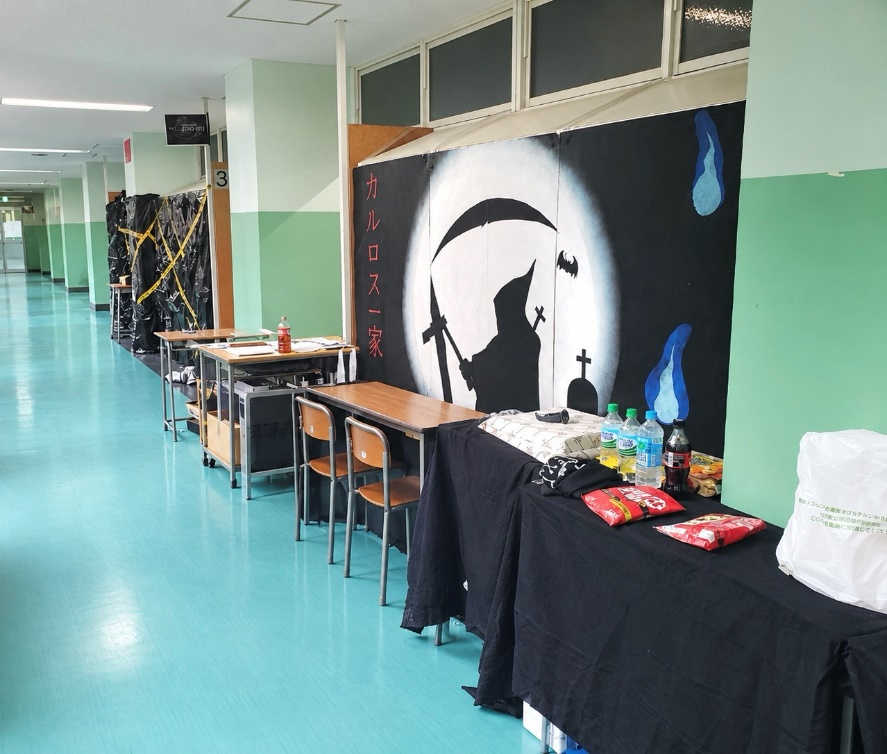

# **カルロス一家って何？？**

　駒場東邦の文化祭には、毎年多くの来場者の方を惹きつける魅力的な様々な企画があります。その中でも、長年に渡って親しまれている企画の一つがカルロス一家です。「カルロス一家」というのは毎年アーチェリー部が運営していて、今年で52年目になる伝統あるお化け屋敷です。

# **カルロス一家の魅力とは？**

　「カルロス一家」は、お客様を存分に怖がらせるために、内部の装飾、お化けの衣装、照明、音、そして驚かせ方に至るまで様々な工夫を凝らしています。それを可能にしているのが52年間のお化け屋敷のノウハウです。今までの52年間の積み重ねにより「カルロス一家」をより洗練しているのです。しかし、毎年「カルロス一家」の内容が同じというわけではありません。「カルロス一家」では受け継がれてきたものを大切にしながらも、毎年家主（カルロス一家のリーダー）が思いついた新しいお化けや装飾など新要素を取り入れており、年による違いや新鮮さを感じることができます。もちろん、今年も新要素が追加されています。また、普段はただの学校の教室として使っている所を、文化祭の期間だけお客様が「なんだここは⁉本当に教室か??」と思うくらい全く別の異世界のような場所へ変えてしまうのも「カルロス一家」の大きな魅力の一つです。

# **過去の受賞歴**

　「カルロス一家」は過去に様々な賞を受賞しています。以下がその一覧です。

2022年度　MVP賞

2023年度　大衆賞駒場グループ公演部門金賞

2024年度　装飾部門賞部活同好会の部金賞　参加団体部門賞公演部門銀賞

2025年度　大衆賞駒場杯公演部門金賞　参加団体部門賞公演部門金賞

この他にもここには載せれないほどたくさんの賞を過去に受賞しています。また、「大衆賞」は来場者の方の投票によって受賞団体が決まる賞なので、カルロス一家への投票のご協力をお願いいたします。

# **お客様へのお願い**

以下の点にご協力お願いいたします。

・お化けへの故意の接触、暴力はお止めください

・館内での写真、動画の撮影はお控えください

・館内では走らず、歩いてください

・混雑時は教室前の椅子に座って順番でお待ちください

・「カルロス一家」を出たらすぐ左手にある机で感想ノートへのご記入をお願いします

・本当に怖すぎて動けなくなったりしたら「ギブアップ」を申し出て外に出ることができます。無理をしすぎないようにお願いします

・何か困ったことなどがあれば何でも黒いカルロスTシャツを着たスタッフまで！

## **あなたは最後まで辿り着ける？**

　駒場東邦の文化祭にお越しの際は、ぜひ中学棟3階36Rの「カルロス一家」に足を運んでみてください。お客様を驚かそうとしている恐ろしいお化けたちが待っています！

↑去年の外の様子
