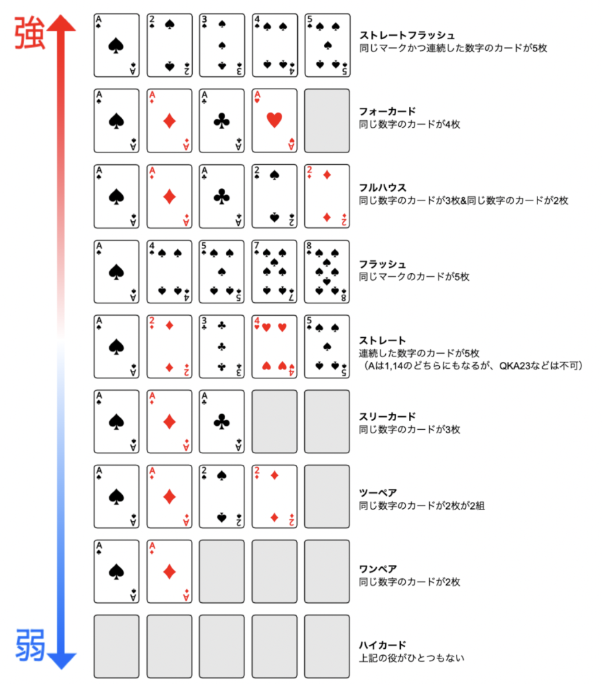
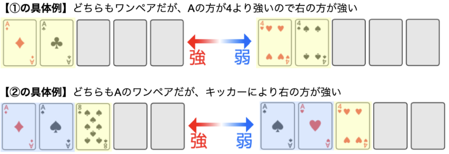
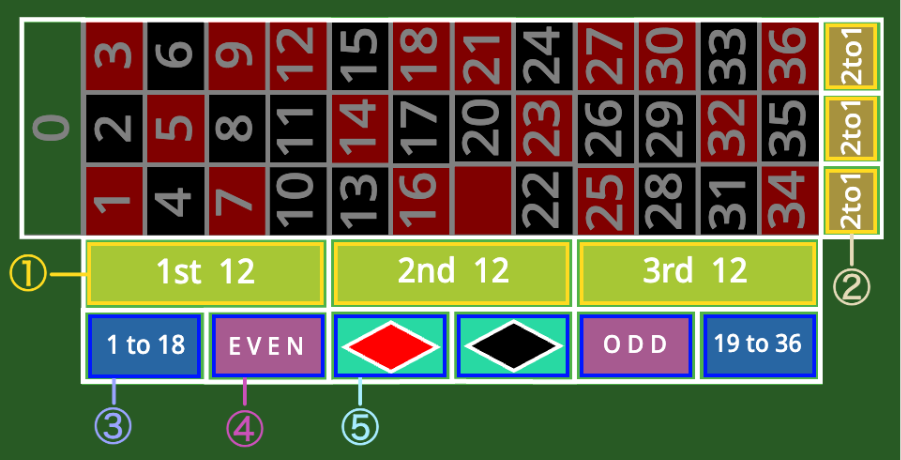
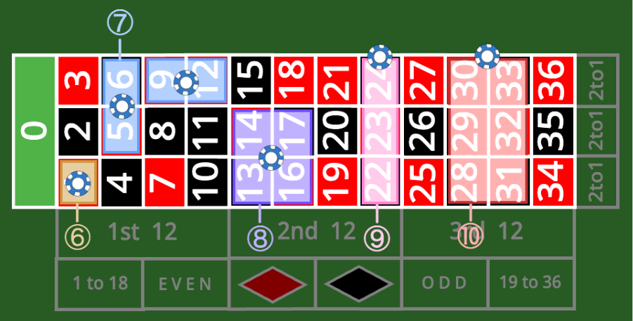

# コマベガスへようこそ！ 

**中学棟3階35Rのコマベガスで、本格的かつ非日常なカジノを体験しませんか？**

中3有志企画”コマベガス”の紹介ページです。これから駒東の文化祭を訪れる予定の方、どこの企画を訪れるか迷っている方、コマベガスの教室前で順番を待っている方など、ぜひこのページをご覧ください！

## 皆様へのお願い 

以下の点にご協力をお願いいたします。

・混雑時には、教室前の列で順番にお待ちください。

・受付で渡されるコイン、プラスチック製のコップは大切に使用してください。

・ゲーム中にはディーラー（ゲームを進行する人）の指示に従ってください。

・混雑状況により変わりますが、15分〜30分程度で退出をお願いします。詳しい時間などは受付で伝えられます。

## ゲームの種類について 

コマベガスではシックボー、ルーレット、ブラックジャック、テキサスホールデム・ポーカーという4種類のゲームを用意しています。ここでは、各ゲームについて簡単に説明し、**この記事の後半で細かいルールを解説します。（シックボー以外）**

**・「シックボー」難易度：★☆☆（簡単）**

サイコロを3個使い、出目や合計を予想して賭けるゲームです。誰でも簡単に遊べる非常にシンプルなゲームです。（ルールを簡略化しています。）

**・「ルーレット」難易度：★☆☆（簡単）**

0〜32の数が書かれたルーレットを使い、どの数が出るかを予想して賭けるゲームです。こちらも同様にシンプルで、誰でも簡単にプレイできます。

**・「ブラックジャック」難易度：★★☆（普通）**

トランプを引き、合計を21に近づけ、ディーラーと勝負するゲームです。合計が21を超えてしまうと負けてしまうので、どこで引くのをやめるかが重要です。ルールはそこまで難しくないので、初心者の方でもプレイできると思います。

**・「テキサス・ホールデムポーカー」難易度：★★★（難しい）**

コミュニティカード（共通のカード）5枚と、ハンド（各プレイヤーのカード）2枚の合計7枚から、5枚を選んで役を作り、その強さでプレイヤー同士で勝負するゲームです。コインを賭けながら、心理戦が繰り広げられます。ポーカーをプレイしたことがない方は難しいと感じるかと思われます。

## コマベガスとは？ 

コマベガスとは、“来場者の皆様に、本格的かつ非日常を味わえるカジノの体験を提供する”という中学3年生による有志企画で、昨年度に引き続き2回目の企画です。昨年度、第68回文化祭では中学２年生の部で”有志団体賞”を獲得することができました。コマベガスに来場してくださった皆様、誠にありがとうございました。

さて、今年度で2年目となるコマベガスですが、去年とほとんど同じような企画という訳ではありません。昨年度、来場者の皆様から頂いたアドバイスや、私たちが課題だと思った点を改善し、昨年度のコマベガスとは一線を画す企画にしました。**中学棟3階35Rのコマベガスに是非立ち寄ってみてください！**

（写真：昨年度の様子）

# テキサス・ホールデムポーカーのルール 

ここでは、テキサス・ホールデムポーカーの細かいルールについて解説します。

## ゲームの流れ 

**① 参加費を出す（ブラインド）**\
親（毎ゲーム変わる）の左隣の人が1コイン、さらにその左隣の人が2コイン強制的に賭けてスタートします。

**② 手札が配られる（プリフロップ）**\
全員にカードが2枚ずつ、裏向きで配られます。他のプレイヤーに見せずに確認します。

**③ 1回目の賭け**\
2コインを賭けた人のさらに左隣の人から順に、時計回りに「アクション」（下部参照）を行います。

**④共通のカードが3枚出る（フロップ）**

テーブルの中央に、全員が使える共通のカード（コミュニティカード）が3枚表向きに出されます。

**⑤ 2回目の賭け**

残っているプレイヤーでさらに「アクション」を行います。

**⑥ 場札がさらに1枚出る（ターン）**\
共通のカードがさらに一枚表向きに出され、計4枚になります。

**⑦ 3回目の賭け**\
残っているプレイヤーでさらに「アクション」を行います。

**⑧ 場札が最後の1枚出る（リバー）**

共通のカードがさらに一枚表向きに出され、計5枚になります。

**⑨ 4回目の賭け**\
残っているプレイヤーでさらに「アクション」を行います。

**⑩手札を公開（ショーダウン）**

4回目の賭けを終え、残ったプレイヤー全員（フォールドしていないプレイヤー）が手札を公開します。5枚の共通のカードと手札の2枚の計7枚から5枚を選んで役を作り、一番強い役を作った人が場に集まったコイン（ポット）をすべて獲得します。

## アクション一覧 

自分の順番が来たら、以下から一つ選んで宣言します。基本的には、自分より前の人がかけたコインの枚数以上を賭けるorゲームから降りる（フォールド）という感覚です。

**・チェック**

コインを賭けずに次の人へパスします。（※まだ誰もコインを賭けていない時などで使えます）

**・コール**

現在賭けられている最高額と同じ枚数のコインを出して、ゲームを続けます。

**・ レイズ**

前の人よりもさらに多くのコインを上乗せして賭けます。

**・ オールイン**

持っているすべてのコインを賭けます。コールやレイズをしたい時に手持ちのコインが足りなくても、これを行うことで最後までゲームに残ることができます。※
オールインで勝った際、他の人が自分より多く賭けていた分のコインは獲得できず、2位の人が獲得します。

**・ フォールド**

コインを賭けずに、カードを伏せてディーラーに返し、このゲームから降ります。それまでに賭けたコインは戻りません。
そのゲームが終わるまで待機となります。

## ポーカーの役一覧 

以下がポーカーで勝敗を決める役の一覧です。上にあるほど強い役で、揃えるのが難しいです。同じ役の場合、役を構成するカードの数の大小で勝敗を決め、強い順にA→K→Q→…→3→2
です。※灰色のカードはキッカーとなります。

## 役の強さの詳細 

ここでは、同じ役（役一覧参照）が完成した場合の勝敗の決め方の詳細を紹介します。以下の①→②の順で考えます。

※テキサス・ホールデムポーカーではマークによって強さが変わることはありません。

**①カードの数字の大きさ**

Aが一番強く、2が一番弱いです。【A→K→Q→J→10→…→3→2】

同じ役の時、役を構成する数字の強さで役の強さを決めます。

**②キッカー**

①が同じだった時、ワンペアやツーペアなど、5枚のうちいくつかのカードだけで役を作っている場合、役に関係ないカードで一番数字が大きいカード（キッカー）の数字を比べます。別紙の「ポーカー役一覧」では灰色になっているカードがキッカーとなります。

※このとき、あくまで役は計7枚（2 +
5）から選んだ5枚なので、キッカーも同じ、もしくはキッカーがない役（ストレートなど）の場合は引き分けとなることに注意してください。

## ブラフについて 

ポーカーは、ただ「強い役を作った人が勝つ」というだけのゲームではありません。
手札が弱くても、相手を騙して勝つことができるテクニック、それがブラフです。

**・ブラフの例**

①あなたの手札はおそらく最弱（ハイカード）で、普通に勝負したら負けそうです。

②そこで、あえて堂々と「レイズ」を宣言し、多くのコインを賭けます。

③相手は「そんなに自信満々に賭けるとは、強い役を持っているんだな…」と思います。

④相手が怖がって「フォールド」してくれれば、あなたの勝ちです。

**・ポイント**

相手が全員フォールドした場合、あなたは自分の弱い手札を誰にも見せずに、ポットのコインを総取りできます。自分の手札を見せなければ、ゲームが終わってもブラフをしたことが相手にはわかりません。何食わぬ顔でブラフをすれば、
弱い手札でも勝利し、大逆転ができるかもしれません。

# ブラックジャックのルール 

ここでは、ブラックジャックの細かいルールについて解説します。

## どのようなゲームか 

・トランプを使い、ディーラーと1対1で戦うゲームです。

・引いたカードの合計の数が21に近い方が勝ちとなります。

・ただし、合計の数が22以上になると、その時点で即負けになります。（バースト）

・【10,J,Q,K】のカードの数は全て“10”とします。

・【A】のカードの数は“1”or“11”のどちらでも数えられます。

## ゲームの流れ 

**① コインを賭ける**

プレイヤーはコインを自由な枚数掛けます。（1枚以上）

**②カードが配られる**

それぞれのプレイヤーとディーラーにディーラーが2枚ずつカードを配ります。

ここで、ディーラーのカードは1枚だけ表になっています。

**③追加でカードを引く**

それぞれのプレイヤーは時計回りに、以下の3つから行動を選びます。

・**ヒット**…カードを追加で1枚引きます。21を超えるまで何度でもヒットできます。

・**スタンド**…これ以上カードを引かずに、今の数でディーラーと勝負します。

・**ダブルダウン**…掛け金を2倍に増やし、カードを1枚だけ引きます。ダブルダウンを選んだ場合これ以上ヒットすることはできません。またヒット→ダブルダウンも不可です。

**④ディーラーのカードの公開**

ディーラーは裏向きのカードを表にします。さらに、ディーラーは合計の数が17以上になるまで自動でカードを引き続けます。

**⑤勝敗の判定**

ディーラーと合計の数を比べて勝敗を決めます。

・ディーラーよりも合計の数が21に近ければ勝利→賭けたコインが2倍になります。

・ディーラーよりも合計の数が21に遠ければ敗北→賭けたコインが没収されます。

・ディーラーと合計の数が同じだったら引き分け→賭けたコインがそのまま返されます。

※プレイヤーの合計の数が22以上の場合は、ディーラーの合計の数にかかわらず敗北となります。

## 最強の「ブラックジャック」 

**・「ブラックジャック」とは**

最初に配られた2枚のカードが【A】と【10,J,Q,Kのどれか】の組み合わせだった場合を「ブラックジャック」と呼びます。

**・21と「ブラックジャック」**

3枚以上のカードで合計の数が21だった場合（5 + 7 + 9
など）よりも、「ブラックジャック」の方が強くなります。例えばディーラーのカードが
【A】【10】で、プレイヤーのカードが【5】【7】【9】だった場合、プレイヤーの敗北となり、賭けたコインは没収されます。

# ルーレットのルール 

## ゲームの流れ 

**①コイン５を賭ける**

ルーレットの出る目を予想して、コインを賭けます。区別するために、賭けたコインには自分の色のマーカーを載せてください。

**②ルーレットを回す**

ディーラーがルーレットを回します。

**③ボールが止まる**

ボールが落ちた数字が当選番号となります。

**④配当**

外れたコインは回収され、当選したチップには配当が付けられます。

※全てのコインの配当が計算されるまで、コインは触らないでください。

## コイン賭け方・配当 

コインの賭け方と配当の倍率は以下の通りです。

①それぞれ1〜12,13〜24,25〜36に賭ける（配当：×3）

②それぞれ縦の一列(1,4,7,…,34など)に賭ける（配当：×3）

③1〜18,19〜36に賭ける（配当：×2）

④偶数(EVEN)、奇数(ODD)に賭ける（配当：×2）

※0は偶数に含みません。

⑤赤、黒に賭ける（倍率：×2）

⑥1つの数字に賭ける（配当：×36）

⑦隣り合う2つの数字に賭ける（配当：×18）

⑧隣り合う4つの数字に賭ける（配当：×9）

⑨横1列の3つの数字に賭ける（配当：×12）

⑩横2列に6つの数字に賭ける（配当：×6）

※企画の都合上、ファースファイブ（5点賭け）はできません。
