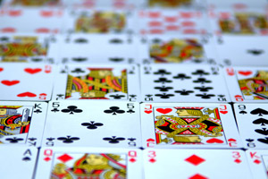
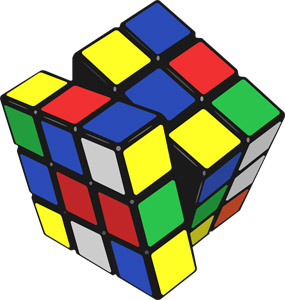

こんにちは！奇術同好会のオンライン展示ページをご覧いただきありがとうございます

これから、奇術同好会の文化祭での活動をご紹介させていただきます\
**活動について**

私たち奇術同好会は、文化祭でトランプを使ったマジックを中心に、ルービックキューブ、そして来場者の皆さまへの"合格祈願"としての「合格トランプ」配布など、幅広い活動を行っている団体です。文化祭で多くの方に驚いていただけるようなパフォーマンスができるように日々努力しています。

**マジック**

私たちはマジックの中でもトランプマジックに注力しています。基本的なテクニックから、本格的な演出まで幅広く扱っています。たとえば、自由に選ばれたはずのトランプを一瞬で見抜いたり、選ばれたトランプの数字や色が変わっていたりなど、観る人を魅了する不思議な世界を体験していただいています。今年もマジックを学べるブースをご用意させていただきますので、マジックを見て、学んで、楽しんでください！

**ルービックキューブ**

おととしから奇術同好会はルービックキューブにも力を入れています。複雑そうに見えるキューブも、実はたくさんの基本手順の積み重ねなので、誰でも完成させることができます。文字だけでは伝えきれませんが、「解けた！」という喜びは、マジックとはまた違った達成感があります。

**合格トランプ**

毎年恒例となっているのが、「合格トランプ」の配布です。この合格トランプは、受験生や試験を控えた方々に向けて、私たちが一枚一枚に応援の気持ちを込めて作成した特製トランプです。遊び心と願掛けが込められたこのカードは、多くの方から好評で、文化祭当日に来場された方に配布しています。

オンラインという形ではありますが、少しでも私たち奇術同好会の魅力を感じていただければ幸いです。来年は、ぜひ実際のブースにも足を運んでいただき、マジックの不思議さ、キューブを解いたときの感動、そして合格祈願のあたたかさを、直接体感していただけたら嬉しいです。

最後までご覧いただき、ありがとうございました！

当日は45Rで活動しています。ぜひお越しください！\
皆さんにとって、この文化祭が楽しい思い出となりますように。

使用した画像のサイト

<https://publicdomainq.net/playing-cards-0069876/>

<https://publicdomainq.net/rubiks-cube-0007064/>
