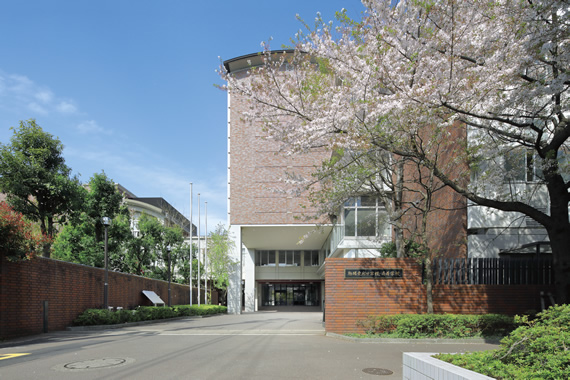

# 駒東生活・受験相談会とは？

駒東生活・受験相談会は、中学1年生と15分間、自由に話すことができる相談企画です。実際に受験を経験し、現在駒東で学校生活を送っている中1だからこそ話せる、リアルな体験やアドバイスをお伝えします。

「駒東って実際どんな学校なんだろう？」「受験勉強ってどうやって進めればいいんだろう？」そんな疑問や不安を、ぜひ私たちに聞いてみてください！

##駒東生活についての質問

授業の雰囲気、友達づくり、部活の選び方、放課後の過ごし方、行事の楽しみ方など、「駒東での毎日」のリアルを中1生がお話しします。

実際に入学して感じたギャップや、学校生活を送るうえでのコツなど、入学したばかりの中1生だからこそ伝えられる等身大の声を聞くことができます。

「友達ってどうやってできるの？」「部活はどんな感じ？」といったちょっとした疑問でも大歓迎です！

↑見慣れた通学路。今日もここから学校生活が始まる。

出典:駒場東邦中学校・高等学校ホームページ（[[https://www.komabajh.toho-u.ac.jp/]{.underline}](https://www.komabajh.toho-u.ac.jp/)）

# 受験相談

受験相談では、勉強の進め方、苦手科目の勉強方法、モチベーションの保ち方、受験直前期の過ごし方、試験当日の心構えなど、受験を経験したからこそお話しできることをお伝えします。

また、受験勉強での挫折や、それを乗り越えるために工夫したことなど、実際に受験を経験した人にしか分からない悩みや工夫についても、できる限りお答えします。

「こんなこと聞いていいのかな？」というような軽い質問も大歓迎です。相談というより"雑談感覚"で、気軽に話してください！

# ご参加について

相談時間は1組15分間を予定しています。15分より短い時間での相談も歓迎です。

相談希望者が多く混雑した場合には、整理券を配布します。整理券を受け取った方は、指定された時間に相談会へお越しください。

整理券の配布状況によっては、希望する時間に相談できない場合があります。相談を希望される方は、できるだけ早めに整理券を受け取ることをおすすめします。

受験生の方はもちろん、保護者の方、駒東に興味がある方など、どんな方でも歓迎です！

2日間の開催に向けて、たくさん準備してきました。駒東生活や受験について、気になることや聞いてみたいことがあれば、ぜひ私たち中1生に相談してください！
