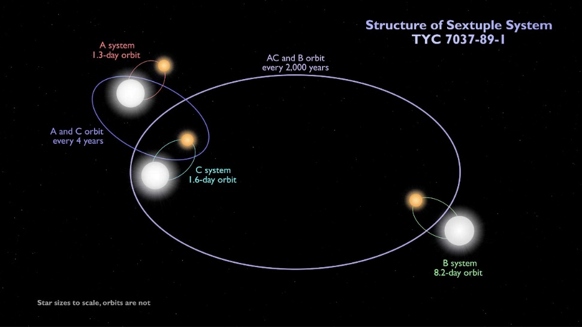
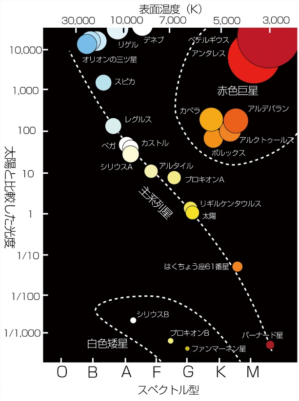

# 連星

皆さんこんばんは。皆さんは連星という言葉を聞いたことがあるでしょうか？夜空の星を見上げてみても、１つ１つは遠すぎて点にしか見えませんが、これらの星の中には恒星同士がぐるぐると回りあっているものがあります。それを連星と言います。ここでは私たちの生活にも深くかかわっている連星の魅力について解説します。

## あれもこれも連星

連星と聞くと珍しいもののように感じられますが、実は宇宙に存在する約半数の恒星は連星であると考えられています。有名なものではおおいぬ座の「シリウス」、おとめ座の「スピカ」、さそり座の「アンタレス」などがあります。

周期はさまざまで、スピカは4日で回りあうのに対し、アンタレスは二つの星が数百天文単位離れた場所で1000年ほどかけて回り合います。

今あげた例は2つの星が回りあうものですが、連星には3つ以上の星が回り合う多重連星も存在しまhttps://astropics.bookbright.co.jp/first-six-star-system-where-all-six-stars-undergo-eclipses

す。例えば、北極星の「ポラリス」は三重連星、オリオン座の「リゲル」は四重連星、みなみじゅうじ座の「アクルックス」は五重連星、ふたご座の「カストル」は六重連星です。そして今までに発見されている最多の多重連星は七重連星です。

## 連星が無かったら？

連星の公転周期や軌道、発する重力波などを知ることで、星の質量、寿命、新天体やブラックホールの発見をすることができます。そのため、連星が無かったら天文学の発展は今よりも遥かに遅れていたでしょう。また、連星が超新星爆発を起こしたり、連星になっていた中性子星が衝突、合体したりすることで、硫黄、カルシウム、鉄、金、プラチナ、ウランなどの重要な元素が合成されるため、連星が無かったら私たちも存在していなかった可能性が高いです。

## おわりに

いかがでしたでしょうか？知ってしまうと連星の存在しない宇宙は想像し難いと思います。きっと夜空を見上げたとき、今までと少し違って見えるでしょう。早速今晩、夜空を見上げてみませんか？

# スペクトル型

SDGｓ‼最近流行っておりますね。そう、スペクトルＧ型の準矮星達、略してＳＤＧｓですね。少しこじつけが過ぎますがスペクトル型の話です。

## スペクトル型とは

スペクトル型とは、恒星を分類する際に用いられるもので、恒星から届く光を波長ごとに分解した「スペクトル」の特徴に基づき、星を分類した基準です。

星の表面温度が高い順に、O・B・A・F・G・K・M型があり、それがさらに細分化されて０～９までの十段階に分けられます。それに加えて、星の明るさと大きさにより、Ia/Ib（超巨星）・II（輝巨星）・III（巨星）・V（主系列星）・VI（準矮星）・VII（白色矮星）などに分類されます。

例えば太陽であれば、表面温度がG2、主系劣星だからVなのでG2Vとなります。

## 何がいいの？

しかしどうしてスペクトル型に分類するのでしょうか？それはスペクトル型が分かると、スペクトル型を聞いただけで多くの情報が得られるからです。スペクトル型によって得られる情報は、星の物質量、地球からの距離、星の年齢・寿命など多岐にわたります。

スペクトル型を覚えるだけで夜空を見上げたときに得られる情報が増えるでしょう。

皆さんもぜひスペクトル型を覚えてみましょう‼　　

https://www.astroarts.co.jp/alacarte/kiso/kiso04-j.shtml
