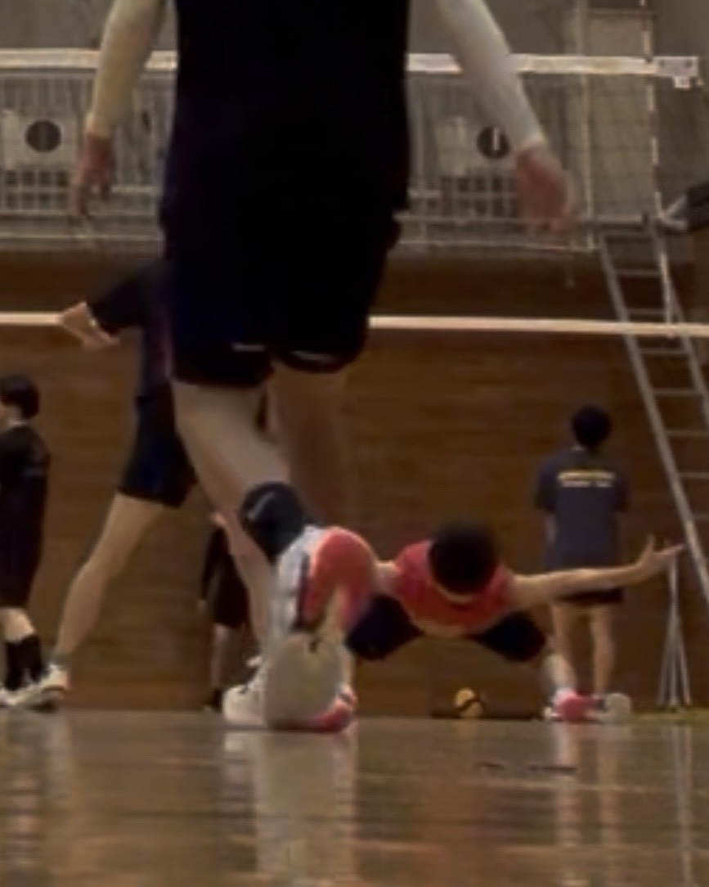

# 企画紹介

今年度のバレーボール部文化祭企画は、歴代OB vs
現役チームの試合を行います。他にも部員による紅白戦や、中学一年生によるバレーボール教室をお届けします！

## ◆ 我が校が誇る絶対的エース　H.S君

見どころは、我が校が誇る超高校級の絶対的エース、満を持してコートに立つH.S君。コートを縦横無尽に駆け回り、異次元の最高到達点から繰り出されるそのスパイクは、もはや言葉を失うレベルの迫力です。

床を穿つような衝撃音が体育館全体に響き渡った瞬間、みなさんは鳥肌が止まらないでしょう！相手の三枚ブロックすら力で粉砕する爽快な一撃と、得点後に見せるエースらしい熱いガッツポーズが、試合のボルテージを最高潮へと叩き上げます。彼の一球一球から目が離せません！

### ◆意地と意地がぶつかり合うOB戦

かつてこの体育館で日々練習してきた歴代のOBたちが集結。ブランクを一切感じさせないプレーで、現役生の前に高い壁として立ちはだかります。OBか、現役か。伝統か、革新か。成人か、未成年か。伝説のOB戦。新たな歴史は黄色と青。二色のボールで彩られます。

#### ◆ ***詳細***

日時： 9月19日（土）
13:40〜16:40（雨天時は中夜祭の準備の影響で予定より早く終わる可能性があります）

場所： 体育館

バレーボールのルールに詳しくない人でも、その迫力と臨場感に一瞬で引き込まれること間違いなし。部員一同、皆さんの熱い声援をお待ちしています！

