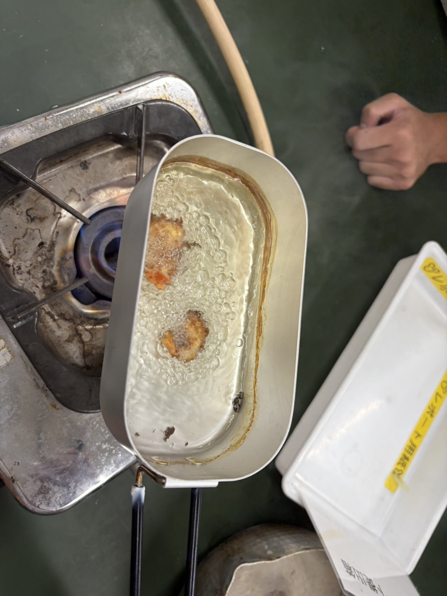

# "ザリフライ"　ザリガニを食べてみた⁉

皆さん、こんにちは。生物部で部長をやっているものです。今回はタイトルの通り、部活でザリガニを食べてみたときのことについて書こうと思います。

まずはなぜザリガニを食べようと思ったか、から話していきたいと思います。時はさかのぼり、僕が小学生のころ...、某大型家具・雑貨店ⅠK〇Aにいた僕はびっくりしました。なんとザリガニが売っていたんです。(ちゃんと食用の種類)僕は衝撃を受けました。その日の寝言でザリガニっていうくらいには衝撃を受けました(本当)。

その日から僕の中でいつか食べてみたい食材として、ザリガニが頭の隅っこにありました。そして、今年の夏、近所にある駒場の公園でザリガニの個体数を確認・採取していた時にそのことをふと思い出しました。

こいつらうまそうだなぁ、と。

思い立ったら、即行動。とりあえず生かして持ち帰りました。(条件付き特定外来なので生かしての移動が例外的に可能です。)
そして、外来生物の有効利用を探るという名目で、(駒場東邦のいいところは危険でなく、理由があれば、何でもやらせてもらえるところです。)
ザリガニをたべることにしました。

一旦泥抜きのため一週間水槽で飼った後、待ちに待った調理の日。

この一週間どう調理してやろうかと検討に検討を重ね、結局たどり着いた結論が、

エビフライ、その名もザリフラィでした。僕にはどうしてもザリガニの身の部分がエビそっくりとしか思えなかったからです。(あと都合がいいことに熱して火を通すので万が一の場合にも備えることができます。)

ということで、前日のうちに、材料(卵や小麦粉、パン粉、ソースなど)や百均の簡易フライパン、キッチンペーパー、油凝固剤(前回の料理でこれを買い忘れて処理がとても大変だった)などの道具を買って、(最近の百均すごい、何でもある)作ってみました。

まず身をむいて、それを小麦粉、卵、パン粉の順に浸し油で揚げました。衛生面は最善の注意を払いましたが、不安なので(駒東生quality)火は表面が黒くなるくらい揚げました。

味のほうは、普通のエビフライでした。(おいしかった。)
そこまで、他のエビフライと違うとこもなく、また泥臭くもなく美味しかったです。ただ一つだけ問題がありました。それがサイズです。全長５から７㎝くらいで一個だけではぜんぜん足りませんでした。しかしおおむね大満足で、想像の(覚悟していた)
１００倍おいしかったです。もっと大きいサイズでやればもっとおいしいかなあと思いました。皆さんもぜひ機会があったら食べてみてください。ありがとうございました。

揚げているときの様子 
