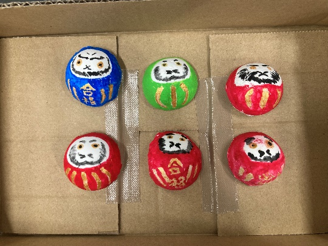
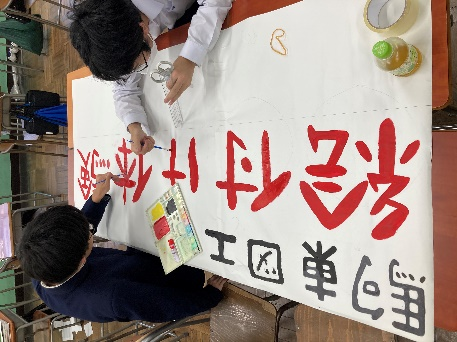

**だるまの絵付け体験～駒東図工～**

**■体験内容**

大匙一杯分の真っ白なマグネット式半球に、絵付け体験ができます。絵付けは自由で、オリジナルの色・顔・文字（「福」「合格」や名前などを自由に！）を入れられます。赤色のみならず、青・黄・黄緑や金色もご用意いたします。もちろんお作りいただいた作品はお持ち帰りいただけるので、受験生の皆さんは勉強のお供におすすめです。もちろん受験生でない方も大歓迎です！（写真は三宅貴撮影）

**■駒東生による事前の準備**

私たちは主に夏休みなどを利用し、マグネット式だるまの土台部分をせっせと工作しました。粘土を大匙に詰め、型を取る作業はうまくいかないこともありましたが、最終的に５００を超える量の製作をしました。（写真は三宅貴撮影）

**■企画の部屋（３１R）へのルート**

❶正面玄関を入って右手に見える水色の階段で３階に上る

❷階段を出ると廊下があるため左手に突き当りまで進む

この手順を踏んでいただくだけで、私たちがお待ちしている中学棟三階、３１Rにお越しいただけます。

**■注意事項**

お作りいただいた作品はお持ち帰りできます。当日中は開催場所である３１Rで保管・乾燥もできますが、お持ち帰りいただく際の紙袋等をご持参いただけると幸いです。

***We sincerely look forward to welcoming you.***
